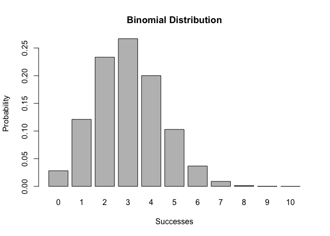
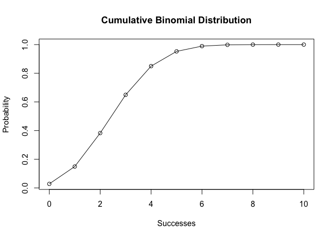

## Context

`"BinDist"` is a package that implements the relevant calculations and
parameters necessary to calculate the Binomial distribution of discrete
random variables, as well as further implementations of the cumulative
binomial distribution and relevant visuals.

  - `bin_choose()` computes the combinations of size k that can be
    selected from size n, order doesn’t matter  
  - `bin_probability()` computes the binomial probability of k successes
    from n trials, with a certain probability of success  
  - `bin_distribution()` compiles the binomial probability of varying
    successes to form a binomial probability distribution  
  - `bin_cumulative()` compiles the cumulative binomial probability to
    form the cumulative provavility distribution  
  - `plot()` plots the distribution of `bin_distribution()` and
    `bin_cumulative()`  
  - `bin_variable()` displays the parameters of the binomial
    distribution  
  - `summary()` applied onto `bin_variable()` displays the summary
    measures of the distribution

-----

\#\#\#Install the Package

Utilize the package `"devtools"` to install the package:

``` r
# install.packages("devtools")

# install "BinDist" without vignettes
devtools::install_github("angglez/binomial")
#> Downloading GitHub repo angglez/binomial@master
#>   
   checking for file ‘/private/var/folders/vf/nj7b74hn2xxb4n55t50knlkw0000gq/T/Rtmpg0ktSM/remotes7145b156a7b/angglez-binomial-bb21805/DESCRIPTION’ ...
  
✔  checking for file ‘/private/var/folders/vf/nj7b74hn2xxb4n55t50knlkw0000gq/T/Rtmpg0ktSM/remotes7145b156a7b/angglez-binomial-bb21805/DESCRIPTION’ (349ms)
#> 
  
─  preparing ‘BinDist’:
#> 
  
   checking DESCRIPTION meta-information ...
  
✔  checking DESCRIPTION meta-information
#> 
  
─  checking for LF line-endings in source and make files and shell scripts
#> 
  
─  checking for empty or unneeded directories
#> 
  
─  building ‘BinDist_0.1.0.tar.gz’
#> 
  
   
#> 
#> Installing package into '/Users/Anglezzz/Library/R/3.5/library'
#> (as 'lib' is unspecified)

# install "BinDist" with vignettes
devtools::install_github("angglez/binomial", build_vignettes=TRUE)
#> Skipping install of 'BinDist' from a github remote, the SHA1 (bb218058) has not changed since last install.
#>   Use `force = TRUE` to force installation
```

-----

\#\#\#Application

``` r
library(BinDist)

#table of binomial probability distribution and cumulative probability distribution
dis2 <- bin_cumulative(10,0.3)
dis2
#>    success  probability cumulative
#> 1        0 0.0282475249 0.02824752
#> 2        1 0.1210608210 0.14930835
#> 3        2 0.2334744405 0.38278279
#> 4        3 0.2668279320 0.64961072
#> 5        4 0.2001209490 0.84973167
#> 6        5 0.1029193452 0.95265101
#> 7        6 0.0367569090 0.98940792
#> 8        7 0.0090016920 0.99840961
#> 9        8 0.0014467005 0.99985631
#> 10       9 0.0001377810 0.99999410
#> 11      10 0.0000059049 1.00000000

#graph of binomial probability distribution
dis1 <- bin_distribution(10,0.3)
plot(dis1)

#graph of cumulative binomial probability distribution
plot(dis2)

#display of binomial distribution variables and summary measures
sum <- bin_variable(10,0.3)
summary(sum)
#> Summary Binomial
#> 
#> Parameters
#> - number of trials: 10 
#> - prob of success: 0.3 
#> 
#> Measures
#> - mean: 3 
#> - variance: 2.1 
#> - mode: 3 
#> - skewness: 0.2760262 
#> - kurtosis: -0.1238095
```


