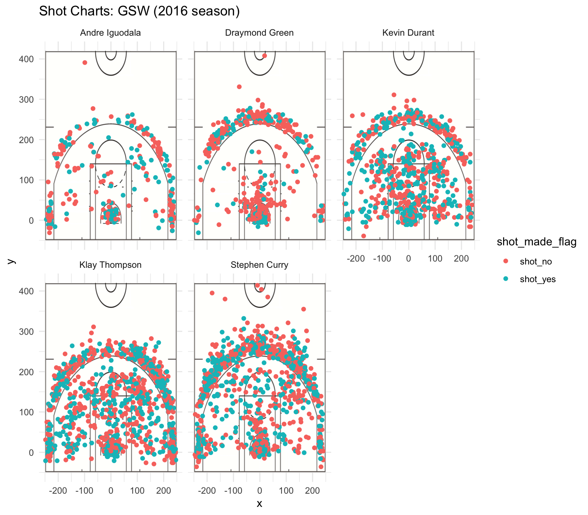

Workout 1
================
Angela Gao

Golden State Warriors Major Players in the 2016 Season
------------------------------------------------------

##### Shooting Statistics of Andre Iguodala, Draymond Green, Kevin Durant, Klay Thompson, and Stephen Curry

From the perspective of someone who is not an avid fan of basketball, or any sports for that matter, here is a technical presentation of some interesting implications stemming from the historical data derived from the 2016 NBA season. Focusing primarily on select players that arguably have the greatest contributions to the team, I will present visual representations and technical analyses of their resulting aggregate performance in terms of hard results - shots attempted and made.

------------------------------------------------------------------------

###### Background Information


The Golden State Warriors, nicknamed *Dubs*, are an American professional basketball team that is currently based in Oakland, CA. It was initially founded in 1946 as the Philadelphia Warriors before relocating to the San Francisco Bay Area in 1962, taking the city's name to be the San Francisco Warriors. In 1971, they finalized to the current name of Golden State Warriors.

The team falls under basketball league Western Conference Pacific Division and competes in the National Basketball Association (NBA). The Warriors have had a tumultuous history between championships and rebuilding throughout the decades. This current new era of success has been led by Stephen Curry, as well as All-Stars Klay Thompson and Draymond Green. Andre Iguodala and former league MVP Kevin Durant have also played major roles in this new era. The Golden State Warriors have six NBA championships and have an estimated value of approximately $3.1 billion.

------------------------------------------------------------------------

###### Preliminary Data Analysis

The primary data we are focusing on relates to all shots attempted by these five select players throughout the course of the season, taking note whether or not the shot was successful or not as well as their locations later on.

A preliminary look at the data presents the effective shooting accuracy of each player, divided into two point and three point shots as well as the aggregate shots.

    ## 
    ## Attaching package: 'dplyr'

    ## The following objects are masked from 'package:stats':
    ## 
    ##     filter, lag

    ## The following objects are masked from 'package:base':
    ## 
    ##     intersect, setdiff, setequal, union

``` r
shots_data <- read.csv(file="../data/shots-data.csv", row.names=1, header=TRUE)

two_point <- filter(shots_data, shot_type=="2PT Field Goal")
two_point <- summarise(group_by(two_point, name), total=length(name), made=sum(shot_made_flag=="shot_yes"))
two_point <- arrange(mutate(two_point, perc_made=made/total), desc(perc_made))
two_point
```

    ## # A tibble: 5 x 4
    ##   name           total  made perc_made
    ##   <fct>          <int> <int>     <dbl>
    ## 1 Andre Iguodala   210   134     0.638
    ## 2 Kevin Durant     643   390     0.607
    ## 3 Stephen Curry    563   304     0.540
    ## 4 Klay Thompson    640   329     0.514
    ## 5 Draymond Green   346   171     0.494

This table focuses only on the two point shots that were made. The total number of shots made between players varies greatly between a seeminly unrevealing range of 433. Taking the percentages of shots made from each player, we can see a much more reasonable level of variation of around 14%. Andre Iguodala holds the highest two pointer shooting at 63.8% and Draymond Green, the lowest at 49.4%.

``` r
three_point <- filter(shots_data, shot_type=="3PT Field Goal")
three_point <- summarise(group_by(three_point, name), total=length(name), made=sum(shot_made_flag=="shot_yes"))
three_point <- arrange(mutate(three_point, perc_made=made/total), desc(perc_made))
three_point
```

    ## # A tibble: 5 x 4
    ##   name           total  made perc_made
    ##   <fct>          <int> <int>     <dbl>
    ## 1 Klay Thompson    580   246     0.424
    ## 2 Stephen Curry    687   280     0.408
    ## 3 Kevin Durant     272   105     0.386
    ## 4 Andre Iguodala   161    58     0.360
    ## 5 Draymond Green   232    74     0.319

In a similar fashion, this table shows the effective shooting percentages of the players but for three point shots. The total number of three pointers attempted are very similar to that of the two pointers however the number of three pointers made is naturally shifted lower. The range in percentage of shots made is also smaller in this case, only around 10%. Klay Thompson has the highest three pointer shooting at 42.4%. Draymond Green still has the lowest percentage at 31.9%.

``` r
overall <- summarise(group_by(shots_data, name), total=length(name), made=sum(shot_made_flag=="shot_yes"))
overall <- arrange(mutate(overall, perc_made=made/total), desc(perc_made))
overall
```

    ## # A tibble: 5 x 4
    ##   name           total  made perc_made
    ##   <fct>          <int> <int>     <dbl>
    ## 1 Kevin Durant     915   495     0.541
    ## 2 Andre Iguodala   371   192     0.518
    ## 3 Klay Thompson   1220   575     0.471
    ## 4 Stephen Curry   1250   584     0.467
    ## 5 Draymond Green   578   245     0.424

The aggregate of both two pointers and three pointers nicely summarizes the data across players. The maximum and minimum values for percentage of shots made lies right between that of the two pointers and three pointers. The overall maximum effective shooting percentage is given to Kevin Durant with 54.1%. Draymond Green had the minimum for both two pointers and three pointers so naturally, he has the overall minimum at 42.4%.

------------------------------------------------------------------------

###### Post-manipulation Visual Analysis

Using the x and y coordinates of all the shots attempted by player we can create visual shot charts mapping the shots, each point coded in color depending of whether or not it was successful, against a visual of the basketball court.



Just with a visual analysis there are a few trends that immediately seem to jump out:
1. Klay Thompson, Stephen Curry, and Kevin Durant have a distinctly greater cumulation of shots attempted throughout the season and overall, very similar shot charts. The concentration of points contrasts greatly with that of Andre Iguodala and Draymond Green.
2. As noted previously looking at the tables, Draymond Green had the lowest efficiency percentages among the five and you can see a greater concentration of red dots in his shot chart relative to the others.
3. I also found it interesting that there are a few red stragglers near the top of the chart in Andre Iguodala, Draymond Green, and Stephen Curry's shot charts.

``` r
perc_made_plot <- full_join(full_join(two_point, three_point, by=c("name"="name")), overall, by=c("name"="name"))
total_shots <- ggplot(perc_made_plot, aes(x=name, y=total, fill=perc_made)) + geom_bar(position='dodge', stat='identity') 
total_shots + geom_text(aes(label=perc_made)) + ggtitle("GSW Select Players Shots (2016 season)") + theme_minimal()
```


Directly from the aggregate data table earlier, above is a barchart of the total shots for each player, colored by the effective shooting percentage. Looking back on the tables again, Kevin Durant had the highest overall efficiency percentage though he was only 2nd and 3rd amongst the five players for two pointers and three pointers, respectively. In this barchart, Durant also has the median number of total shots.

------------------------------------------------------------------------

###### Conclusions

From observations of the data summary statistics and various visual representations, I found the data to result in some interesting notions. Most notably, Kevin Durant held about average effective shooting percentages for two pointers and three pointers individually but did the best if you account for both of them collectively. Similarly, Durant also did not attempt the most shots, hitting the median amongst the five again. Comparing him to Thompson who does the best for three pointers but ranks fourth for two pointers and Iguodala who ranks the exact opposite (first for two pointers and fourth for three pointers) it goes to show that being able to do around average or slightly above can go farther that specializing in only one avenue.

------------------------------------------------------------------------

###### References

<https://en.wikipedia.org/wiki/Golden_State_Warriors>
